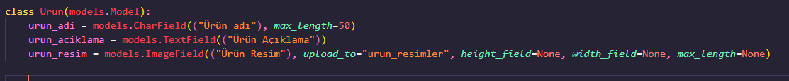
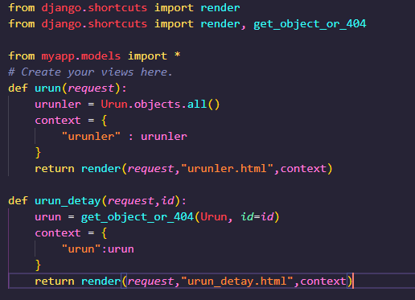
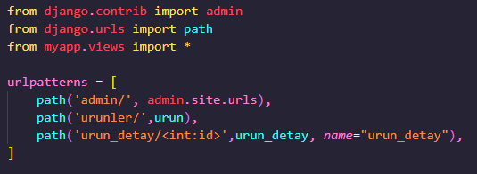
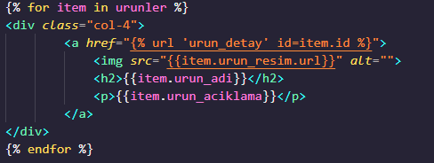
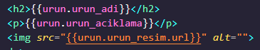
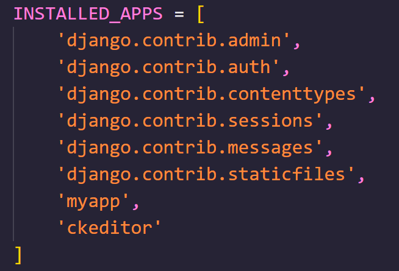
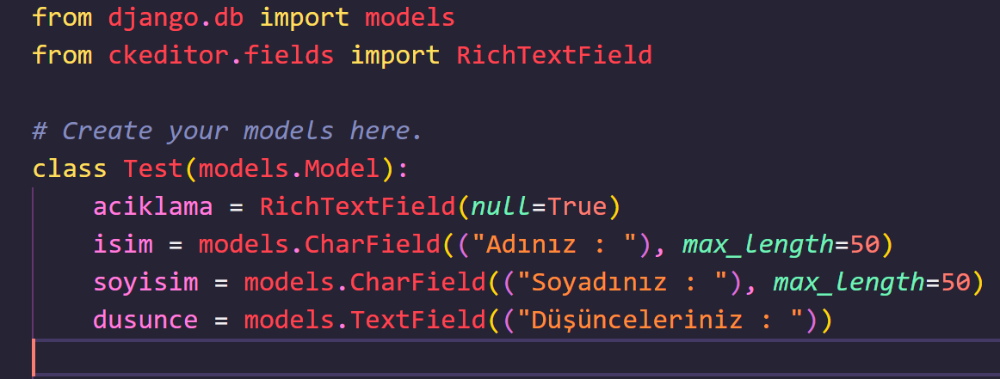
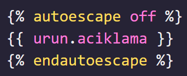

## DİNAMİK SAYFALAR OLUŞTURMAK
Öncelikle örnek olarak ürün modelimizi oluşturalım  
    

Ardından sayfa yönlendirmeleri ile views.py fonskiyoruları oluşturalım  
    

urls.py içerisinde ise sayfa yönlendirmelerini id'ye göre ayarlayalım  
    

Son olarakta urun sayfasını ve detay sayfasını oluşturalım  
    
    

## CKEDITOR KULLANIMI
pip install django-ckeditor komutu ile ckeditoru yüklüyoruz    

setting.py içerisinde installed_app içerisine ckeditoru ekliyoruz  
    

Model içerisinde **from ckeditor.fields import RichTextField** komutu ile içeriye aktarıyoruz ve son olarak açıklama yaptırmak istediğimiz alanda **RichTextField()** Kullanıyoruz.  
    

Ckeditor çıktısını DOM'a yansıtmak için **autoescape** Kullanılır.  
Dikkat edilmesi gereken ise otomatik autospace tamamlamasında kapanışında **end** içeriği atılmaz.  
Burada biz kedmiz autospace'in kapanış başına **end** ifadesini ekleyeceğiz
    

